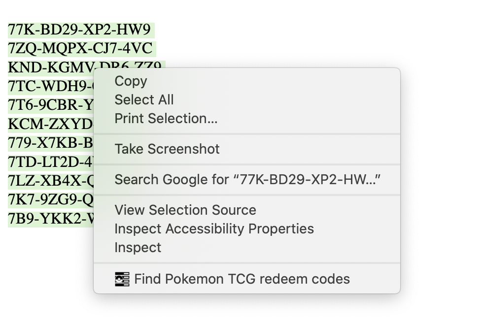
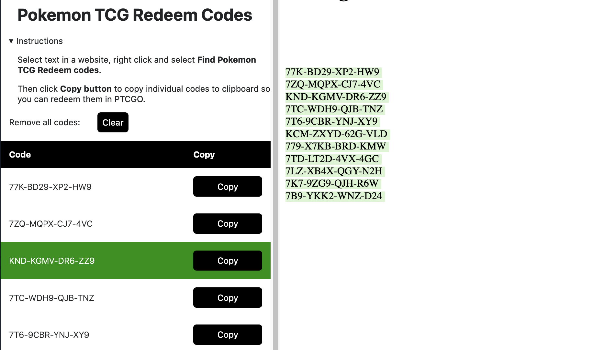

# Pokemon TCG Online Redeem Code Helper extension for Firefox

This extension helps Pokemon TCG Online players to redeem their codes.

Many stores sell PTCGO codes in bulk. When ordered, you often receive a long list of codes to your email or on a website and manually copy-pasting them to the Online client is burdensome.

With this extension, all you need is to select the text on the website or email with those codes, right click, select **Find Pokemon TCG redeem codes** and you'll get a much improved user experience.

## Features

### Context Menu

Select text that includes PTCGO Redeem Codes – doesn't need to be **only** codes but any text – right click to open context menu and select **Find Pokemon TCG redeem codes**.

This will find all text that matches PTCGO Redeem Code pattern and opens up a sidebar.

### Sidebar

Click **Copy** to copy an individual code to the clipboard. There's no worry about missing some characters or copying an extra space.

Once copied, the row will turn green to indicate that the user has already copied it. This helps the user see which codes they have copied already.

## Disclaimer

This extension is not endorsed by, directly affiliated with, maintained, authorized, or sponsored by The Pokémon Company International, The Pokémon Company, Nintendo, Creatures Inc, Game Freak or any other Pokemon related company.

---

## Development

To develop, install [web-ext](https://github.com/mozilla/web-ext) and run `web-ext run` to start a Firefox instance with the extension loaded.

### Testing server

To help testing the extension, in [tests/](tests/), you can run a local http server (for example with `python -m http.server 9000` or `npx http-server -p 9000`) to load an example page with a few already-used redeem codes.

When it's running, you can open the extension on Firefox with `web-ext run --start-url localhost:9000 --bc` to automatically nagivate to local test page and open browser console for logs. 

### Build

To build, create a zip archive with `manifest.json`, `background.js`, `README.md`, `icons/` and `sidebar/` folders.